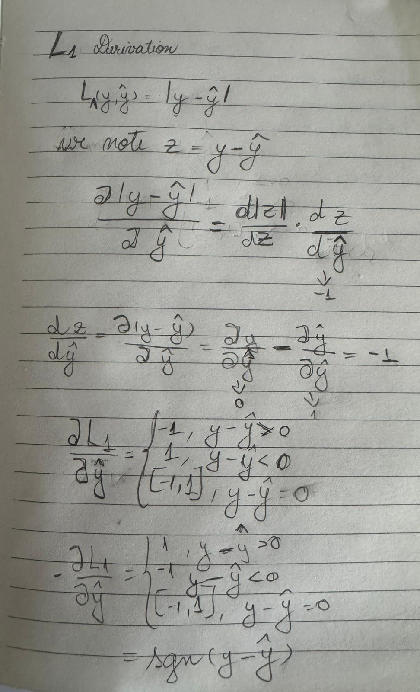
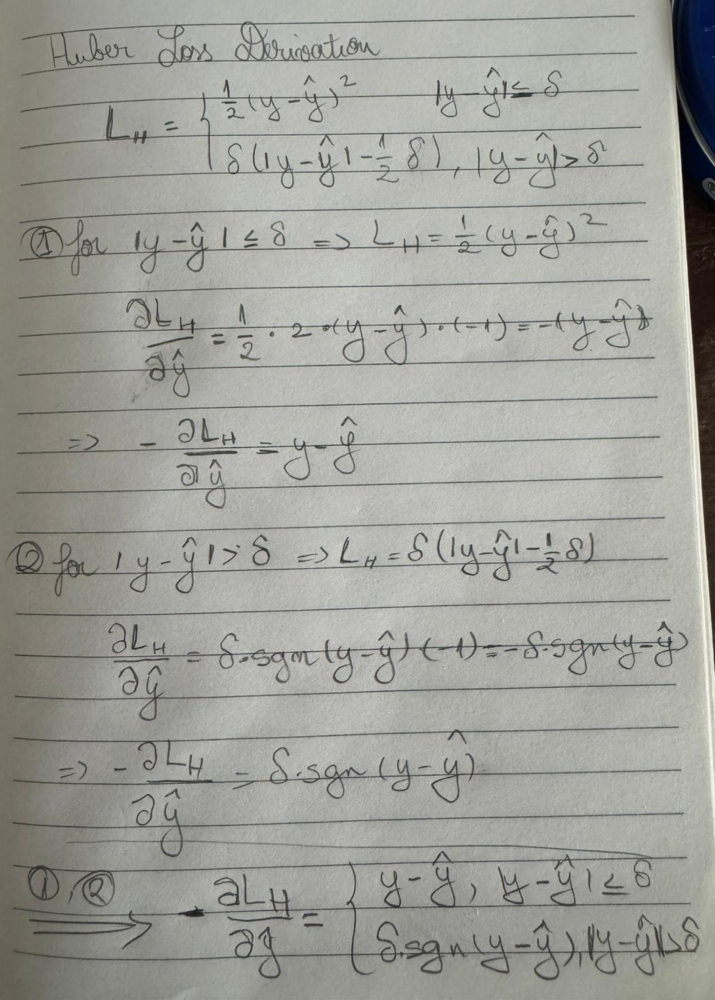
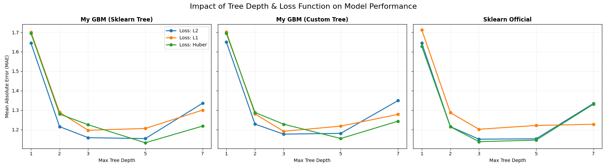
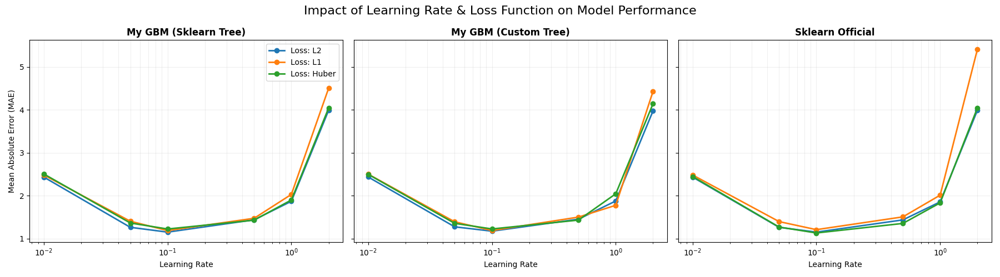
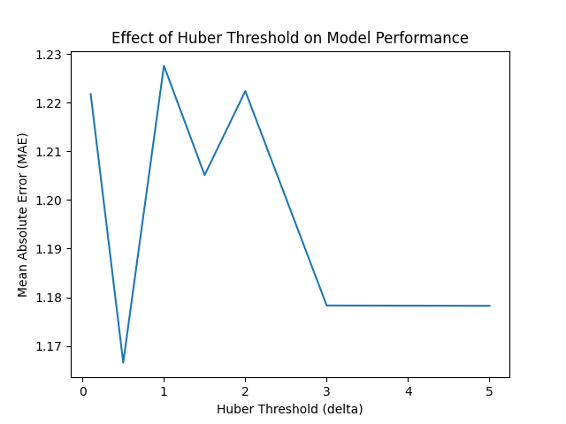
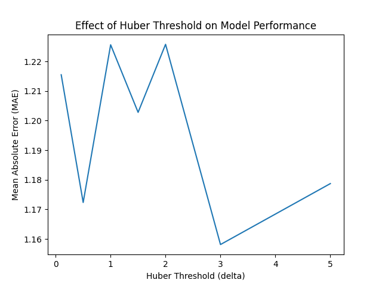
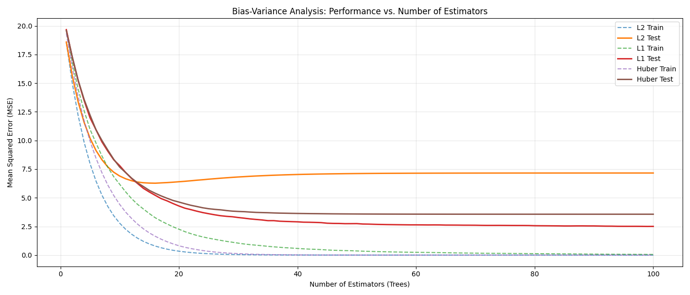


# Gradient Boosting

## Introduction
This report describes the implementation and evaluation of a Gradient Boosting Regressor developed from scratch. The main focus of the work is on the implementation of different loss functions and the computation of their corresponding negative gradients. These negative gradients are used during training to update the model at each boosting iteration.

The implemented model supports three loss functions: squared error loss (L2), absolute error loss (L1), and Huber loss. For each loss function, the negative gradient is derived and implemented explicitly, and decision trees are trained to fit these values. The experiments performed analyze how the choice of loss function and several model parameters affect training and test performance.

## Implemented Loss Functions and Negative Gradients

### Role of the Loss Function in the Implementation
In the implemented Gradient Boosting Regressor (`GBRegressor` class in `Boosting.py`), the loss function determines how prediction errors are quantified and how the model is updated at each boosting iteration. The model fits each weak learner to the negative gradient of the loss function with respect to the current predictions. These negative gradients are also referred to as pseudo-residuals.

At iteration *m*, given the current predictions $\hat{y}^{(m-1)}$, the algorithm computes the negative gradient
$$
r^{(m)} = -\frac{\partial L(y, \hat{y})}{\partial \hat{y}} \Bigg|_{\hat{y} = \hat{y}^{(m-1)}}
$$
and trains a regression tree to predict $r^{(m)}$. The model predictions are then updated using a learning rate $\eta$.


The method `_get_negative_gradient` encapsulates this logic and dispatches the gradient computation based on the selected loss type (L2, L1, or Huber).

### L2 Loss (Squared Error)
The L2 loss is defined as: $$L(y, \hat{y}) = (y - \hat{y})^2	$$

L2 loss penalizes larger errors quadratically, meaning that predictions that are far from the true target are penalized more severely than smaller errors. This property makes it particularly suitable for regression problems where large deviations are undesirable. By emphasizing large residuals, L2 encourages the model to quickly reduce the most significant errors first.

Taking the derivative of the loss with respect to the prediction $\hat{y}$​ gives: $$\frac{\partial L}{\partial \hat{y}} = -2(y - \hat{y})$$ The negative gradient is therefore: $$-\frac{\partial L}{\partial \hat{y}} = 2(y - \hat{y})$$

In practice, the constant factor does not affect the training process and can be absorbed into the learning rate. As a result, the negative gradient is proportional to the residual.

In the implementation, the negative gradient for the L2 loss is computed as the difference between the true target values and the current predictions:
```
residuals = y - prediction
```
Each decision tree is trained to predict these residuals. This leads to smooth updates and fast improvement in training performance.

### L1 Loss (Absolute Error)
The L1 loss is defined as: $$L(y, \hat{y}) = |y - \hat{y}|$$ L1 loss penalizes errors linearly, meaning it treats all deviations with equal weight relative to their size. Because it does not square the residual, a single massive error does not disproportionately dominate the total loss calculation. 

By using a constant gradient, L1 encourages the model to move toward the median of the data. While this can lead to slower convergence as the model's focus isn't to fix the largest errors first, it results in a much more stable and robust fit in the presence of anomalies.



The derivative of the absolute value function is not defined at zero, but can be expressed using the sign function: $$\frac{\partial L}{\partial \hat{y}} = \begin{cases} -1 & \text{if } y > \hat{y} \\ 1 & \text{if } y < \hat{y} \end{cases}$$ Thus, the negative gradient is: $$-\frac{\partial L}{\partial \hat{y}} = \text{sign}(y - \hat{y})$$ In the implementation, the negative gradient for L1 loss is computed using the sign of the residual: 

```
ngrad = np.sign(y - prediction)
```
This produces gradients that take only the values -1, 0 or 1. As a result, the trees trained under L1 loss focus on correcting the direction of the error rather than its magnitude. This leads to slower convergence but increased robustness to large errors.

### Huber Loss
The Huber loss combines the properties of L2 and L1 losses and is defined as: $$L(y, \hat{y}) = \begin{cases} \frac{1}{2}(y - \hat{y})^2 & \text{if } |y - \hat{y}| \le \delta \\ \delta |y - \hat{y}| - \frac{1}{2}\delta^2 & \text{if } |y - \hat{y}| > \delta \end{cases}$$ Huber loss changes how it works based on the size of the error. By using a squared penalty for small errors (below $\delta$), it creates a smooth path that allows the model to settle precisely on the best answer without the unstable jumping often seen when using L1. For larger errors (above $\delta$), it switches to a linear penalty, which effectively limits how much power outliers have over the model. This makes it the best choice for users who want the high accuracy of L2 for most of their data but do not want their model to be ruined by a few extreme data points. 



The derivative behavior changes based on the size of the residual relative to $\delta$. For small residuals ($|y - \hat{y}| \le \delta$): $$-\frac{\partial L}{\partial \hat{y}} = y - \hat{y}$$ For large residuals ($|y - \hat{y}| > \delta$): $$-\frac{\partial L}{\partial \hat{y}} = \delta \cdot \text{sign}(y - \hat{y})$$ 

In the code, the negative gradient is computed using a formulation based on the magnitude of the residual: 

```
if abs_residual <= delta: 
	grad = residual 
else: 
	grad = delta * np.sign(residual)
```
This allows the model to benefit from smooth gradients when errors are small, while limiting the influence of outliers during training.

## Experiments Results

### Experiment 1 
This validates the correctness of the custom Gradient Boosting Regressor using a simple one-dimensional synthetic dataset with 300 samples and Gaussian noise (σ ≈ 10). The model is trained using 100 estimators with depth-1 decision stumps, which allows the predicted regression function to be visualized directly over the data. The experiment compares three setups: the custom GBRegressor using Scikit-Learn trees, the same model using a fully custom decision tree (MyDecisionTree), and Scikit-Learn’s official GradientBoostingRegressor, each evaluated with L2, L1, and Huber losses.

The numerical results show near-identical performance between the custom implementation and Scikit-Learn. For L2 loss, both achieve an MAE ≈ 8.65, MSE ≈ 126.49, and R² ≈ 0.878, confirming that gradient computation and ensemble aggregation are correct. For L1 and Huber losses, R² values are slightly lower (≈ 0.851–0.852), which is expected given the noise distribution, and the metrics again closely match the Scikit-Learn baseline. These results demonstrate that all loss functions are implemented correctly and behave consistently with standard references.

When using the fully custom decision tree, performance slightly improves, reaching an R² of 0.8816 for L2 loss and a lower MSE of 122.25, indicating marginally better splits on this dataset. However, this improvement comes at a significant computational cost: runtime increases from about 0.05–0.13 seconds for Scikit-Learn-based models to around 1.4–1.5 seconds for the custom tree due to the overhead of pure Python execution. Overall, Experiment 1 confirms the mathematical correctness of the custom Gradient Boosting.

### Experiment 2
This experiment tests the scalability of the custom Gradient Boosting Regressor by increasing the problem dimensionality from 1 to 10 features and 500 samples, using trees of max depth 3 and 100 estimators. This setup evaluates whether the gradient computation, residual fitting, and split-search logic remain stable and correct in higher-dimensional spaces, where feature selection becomes non-trivial.

The results show that the custom implementation closely matches Scikit-Learn across all loss functions. For L2 loss, both achieve an R² ≈ 0.871, with MAE around 39.7 and MSE around 2533. L1 and Huber losses show slightly lower R² values (≈ 0.81–0.82), again consistent across custom and Scikit-Learn implementations. These near-identical metrics confirm mathematical correctness in multi-feature settings.

Runtime remains reasonable (≈ 0.37–0.50 s for the custom GBM and ≈ 0.41–0.66 s for Scikit-Learn), indicating that while optimized implementations are still faster, the performance gap is much smaller than in Experiment 1. 

### Experiment 3 
This experiment evaluates robustness to noise and outliers using 1000 samples and two datasets: a linear function and a non-linear sine function, both corrupted with injected outliers. The experiment uses depth-1 trees and 100 estimators, to observe how each loss reacts to extreme values.

On the linear dataset, L2 loss yields an MAE of about 5.0 and an R² ≈ 0.03, indicating distortion caused by outliers. L1 and Huber slightly improve robustness, reducing MAE to about 4.3 while maintaining similar R² values. Visually, L2 shifts toward outliers, whereas L1 and Huber stay closer to the central data trend.

On the non-linear dataset, the pattern is even clearer: L2 produces negative or near-zero R² (≈ −0.01), while L1 and Huber achieve small but positive R² values (≈ 0.015). This experiment quantitatively demonstrates that L2 is highly sensitive to outliers, L1 is robust but less flexible, and Huber offers the best balance between robustness and expressive power.

### Experiment 4
This experiment studies the impact of weak learner complexity by varying tree depth across [1, 2, 3, 5, 7] using the Friedman dataset with 10 features. All models use 100 estimators and a learning rate of 0.1, allowing a controlled analysis of the bias–variance trade-off.



At depth 1, all models exhibit high bias, resulting in higher MAE values. Increasing the depth to 3 or 5 significantly reduces MAE, indicating that the model can now capture feature interactions present in the data. This depth range consistently produces the lowest error across custom and Scikit-Learn implementations.

When depth increases to 7, MAE starts to rise again, signaling overfitting. Experiment 4 numerically confirms the theoretical expectation that gradient boosting performs best with moderately complex weak learners, balancing bias and variance.

### Experiment 5
This experiment analyzes the effect of the learning rate by testing values [0.01, 0.05, 0.1, 0.5, 1.0, 2.0], again using 100 estimators and depth-3 trees. The goal is to quantify how aggressively residuals should be corrected at each boosting step.



For very small learning rates (e.g., 0.01), MAE decreases slowly and remains relatively high, indicating underfitting due to insufficient total learning capacity. At very large values (≥ 1.0), MAE fluctuates or increases, showing unstable behavior and overfitting caused by overly large updates.

The best performance consistently appears at moderate learning rates (around 0.05–0.1), where MAE reaches its minimum across loss functions. This experiment demonstrates that learning rate and number of estimators must be tuned jointly for stable and accurate models.

### Experiment 6
This experiment investigates the influence of the Huber threshold parameter δ, testing values from 0.1 to 5.0. Using the same dataset and 100 estimators with depth-3 trees, the experiment measures how MAE changes as the loss transitions between L1-like and L2-like behavior.





When δ ≤ 0.5, MAE is higher because the model behaves almost like pure L1 loss, becoming overly robust and ignoring useful residual structure. When δ ≥ 3.0, MAE increases again as the model approximates L2 loss and becomes sensitive to outliers.

The lowest MAE occurs at intermediate values (around δ = 1.0–2.0), confirming that δ is a crucial hyperparameter. Experiment 6 shows quantitatively that Huber loss must be tuned to match the noise characteristics of the dataset.

### Experiment 7
This experiment visualizes the learning trajectory by plotting training and test MSE as a function of the number of estimators (up to 100 trees), using a learning rate of 0.1. This experiment explicitly illustrates the bias–variance trade-off during training.



For all losses, training MSE decreases monotonically as more trees are added. Test MSE initially drops sharply, indicating reduced bias, but eventually flattens or slightly increases as variance begins to dominate.

The curves show that Huber and L1 losses typically produce more stable test error curves than L2, especially in noisy regions of the dataset. Experiment 7 provides numerical and visual confirmation of why robust losses often generalize better in gradient boosting.
